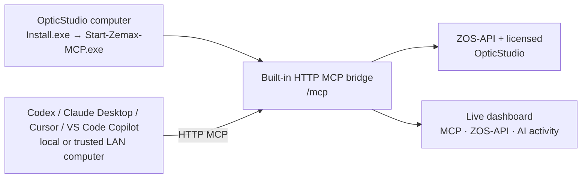

# OpticStudio MCP Server

**A GUI-first Windows HTTP MCP server for Zemax OpticStudio.** It detects installed OpticStudio versions, starts a local or trusted-LAN MCP endpoint, and configures **Codex**, **Claude Desktop**, **Cursor**, and **VS Code / GitHub Copilot** without manual configuration-file editing.

## Windows quick start

1. Download and extract `ZemaxMCP-win-x64.zip` from [Releases](../../releases).
2. Double-click **Install.exe**. It installs for the current Windows user, creates a desktop shortcut, and starts the launcher.
3. At first launch, accept the detected AI-client setup prompt, or choose **Configure AI clients** and select the desired client.
4. Restart the configured AI client once. The status dashboard shows whether MCP, ZOS-API/OpticStudio, and recent AI activity are ready.

The launcher refreshes status every 10 seconds. No Node.js, Supergateway, command line, source checkout, or manual ZOS-API DLL copying is needed for normal use.

For the complete one- and two-computer guide, see [Windows Quick Start](docs/QUICKSTART_WINDOWS.md).

## How it works

For a single computer, the AI client uses the local MCP address. For two computers, enable **Share with a trusted LAN computer** on the OpticStudio computer, copy its address, and paste it into **Remote MCP address** on the AI-client computer.

## Highlights

- **Graphical install and update** — `Install.exe` installs or updates the per-user application. `Portable-Install.cmd` is available where an organisation blocks the installer executable.
- **Built-in HTTP MCP** — The release includes its own .NET HTTP-to-stdio bridge; no external bridge process or Node.js setup is required.
- **Trusted LAN use** — Enable LAN sharing on the OpticStudio computer, copy its address, and configure the AI-client computer graphically.
- **Live status dashboard** — Colour-coded status cards distinguish the MCP service, ZOS-API/OpticStudio connection, and recent AI-client calls.
- **Multi-version OpticStudio detection** — Choose from detected installations; the launcher remembers the choice and can start at sign-in.
- **One AI configuration menu** — Configure detected Codex, Claude Desktop, and Cursor clients directly. VS Code / GitHub Copilot uses its native MCP review and trust flow, so its own profile and workspace configuration remain intact.
- **Safe public package** — The ZIP does not redistribute proprietary ZOS-API DLLs. It uses the licensed OpticStudio installation at runtime on the Zemax computer.

## Connection modes

The server supports the following OpticStudio connection modes:

| Mode | Intended use |
|---|---|
| **Standalone** | Starts or controls an OpticStudio session for automated work. |
| **Extension** | Connects to an already-running OpticStudio session for interactive work. |

Use the launcher status dashboard to confirm that ZOS-API is loaded and OpticStudio is connected before asking the AI to work on a design.

## MCP capabilities

The server exposes a broad tool set. AI clients discover the exact, version-matched schemas through MCP `tools/list`, so this README does not become a stale duplicate of the running server.

Major groups include:

- System and file operations
- Lens Data Editor surfaces, fields, wavelengths, aperture, solves, and extra data
- Non-Sequential Component (NSC) objects and detectors
- Imaging and optical analyses: spot, MTF, PSF, POP, ray fans, aberrations, and illumination
- Optimization, merit functions, operands, constraints, and multistart jobs
- Multi-configuration, tolerance-data-editor (TDE), system settings, and glass-catalog operations

This fork additionally includes the following acceptance and validation tools:

| Tool | Purpose |
|---|---|
| `zemax_set_surface_aperture` / `zemax_get_surface_aperture` | Set or inspect real circular apertures and obscurations. |
| `zemax_set_off_axis_conic` | Read or set Off-Axis Conic Freeform offset and normalization radius. |
| `zemax_get_global_matrix` | Read a surface local-to-global rotation matrix and vertex origin. |
| `zemax_aperture_throughput` | Sample pupil throughput and identify vignette surfaces. |
| `zemax_ray_trace_extended` | Trace a real ray with intercept, direction, intensity, error, and vignette data. |

The server also provides MCP resources for the current system, merit function, and operand documentation, plus prompt templates for design, optimisation, analysis, and design troubleshooting.

## Fork and attribution

This repository is a fork of the MIT-licensed **OpticStudio MCP Server** by Javier A Ruiz. This fork adds the packaged Windows launcher, GUI installer, built-in HTTP MCP bridge, trusted-LAN workflow, live status dashboard, graphical AI-client configuration, and additional acceptance tools.

The original copyright and MIT license are retained in [LICENSE](LICENSE). A valid Zemax OpticStudio licence is required to operate the server.

## Release maintainers

The public ZIP is produced on a trusted Windows computer with a licensed OpticStudio installation. The required ZOS-API files must remain outside source control and the public release. See [Windows Quick Start](docs/QUICKSTART_WINDOWS.md#maintainers-publishing-an-update) for the release-runner requirements.
