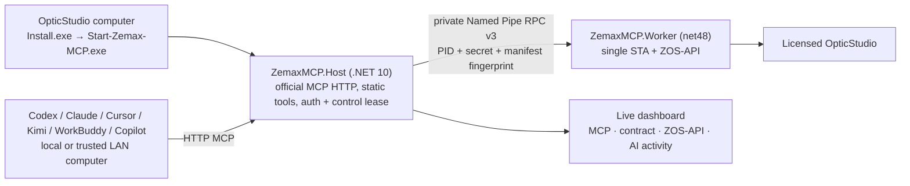

# OpticStudio MCP Server

**A GUI-first Windows HTTP MCP server for Zemax OpticStudio.** It detects installed OpticStudio versions, starts a resilient local or trusted-LAN MCP endpoint, and configures **Codex**, **Claude Desktop**, **Cursor**, **Kimi Code**, **WorkBuddy**, and **VS Code / GitHub Copilot** without manual configuration-file editing.

## Windows quick start

1. Download and extract `ZemaxMCP-win-x64.zip` from [Releases](../../releases).
2. Double-click **Install.exe**. It installs for the current Windows user, creates a desktop shortcut, and starts the launcher.
3. At first launch, accept the detected AI-client setup prompt, or choose **Configure AI clients** and select the desired client.
4. Restart the configured AI client once. The status dashboard distinguishes installed, configured, previously seen, and recently active clients.

The launcher refreshes status every 5 seconds. No Node.js, Supergateway, command line, source checkout, or manual ZOS-API DLL copying is needed for normal use.

For the complete one- and two-computer guide, see [Windows Quick Start](docs/QUICKSTART_WINDOWS.md). For code ownership and dependency boundaries, see [Architecture](docs/ARCHITECTURE.md).

## How it works

```mermaid
flowchart LR
  A["OpticStudio computer\nInstall.exe → Start-Zemax-MCP.exe"] --> B["ZemaxMCP.Host (.NET 10)\nofficial MCP HTTP, static tools, auth + control lease"]
  B -->|"private Named Pipe RPC v3\nPID + secret + manifest fingerprint"| C["ZemaxMCP.Worker (net48)\nsingle STA + ZOS-API"]
  C --> F["Licensed OpticStudio"]
  D["Codex / Claude / Cursor / Kimi / WorkBuddy / Copilot\nlocal or trusted LAN computer"] -->|"HTTP MCP"| B
  B --> E["Live dashboard\nMCP · contract · ZOS-API · AI activity"]
```

For a single computer, the AI client uses the local MCP address. For two computers, enable **Share with a trusted LAN computer** on the OpticStudio computer, choose **Copy secure setup**, then paste the complete copied bundle into the single **Secure setup** field on the AI computer. It automatically extracts both the endpoint and token, stores the token with Windows user-scope encryption, and writes it into supported AI-client configurations automatically.

## Highlights

- **Graphical install and update** — `Install.exe` installs or updates the per-user application. `Portable-Install.cmd` is available where an organisation blocks the installer executable.
- **Official .NET 10 MCP Host** — `ZemaxMCP.Host` uses stable `ModelContextProtocol.AspNetCore` 2.1 for Streamable HTTP, protocol negotiation, request IDs, SSE, cancellation, progress, and compatibility. The application no longer maintains a hand-written MCP HTTP/JSON-RPC dispatcher.
- **Static Host tool contract** — a build-time Roslyn generator produces the 126 tool names, descriptions, JSON schemas, domains, and impact levels. `tools/list` is answered by the Host without starting OpticStudio or the Worker.
- **Hardened Host / Worker isolation** — MCP ends at the Host. The `net48` Worker accepts only private RPC v3, keeps STA/ZOS-API state, and never exposes a network transport. The Host verifies Worker PID, per-launch secret, RPC version, and the static manifest SHA-256 fingerprint before ZOS-API is loaded.
- **Transport-independent control lease** — modern MCP requests can be stateless while OpticStudio remains deliberately single-owner, single-STA, and serialized. Per-instance identity prevents supported same-machine clients from collapsing into one owner.
- **Authenticated LAN use** — every launcher-managed request uses a random Bearer token. LAN listening is refused without a token, and token rotation is one click.
- **Lens-change safety** — one explicit metadata catalogue drives both the MCP risk display and ZOS-API protection. Read-only mode blocks high-impact operations; in read/write mode, every recognised mutation first saves a timestamped copy of the current lens, while unknown execution commands fail closed as high impact.
- **Structured progress/events** — Worker job and snapshot callbacks use a serialized event queue. The Host dispatches them independently from result processing, retains recent state for diagnostics, and forwards matching operation progress through MCP when a request supplied a progress token.
- **Verified, clean updates** — release metadata is RSA-signed, the ZIP size and SHA-256 are checked before extraction, and the updater replaces superseded program files while retaining logs and snapshots; it restores the previous installation if replacement fails.
- **Dedicated ZOS-API thread** — the Worker serializes every connection and tool operation on one long-lived STA thread to respect the COM threading model and avoid cross-thread session access.
- **Long-job control** — POP, global search, and multistart optimization can return immediately with a job id. Use `zemax_job_status`, `zemax_job_list`, and `zemax_job_cancel` for queue position, live progress, result retrieval, and cooperative cancellation; the launcher also shows the active tool/job and elapsed time.
- **Per-client live dashboard** — colour-coded cards distinguish installation, configuration, historical activity, and a real request made within the last five minutes. The launcher health check is excluded from AI activity.
- **Multi-version OpticStudio detection** — detects classic Zemax and current `ANSYS Inc\v*` layouts from environment variables, both registry views, uninstall entries, and known Program Files locations. The launcher validates all three ZOS-API assemblies before offering a version.
- **Safe public package** — the ZIP does not redistribute proprietary ZOS-API DLLs. It uses the licensed OpticStudio installation at runtime on the Zemax computer.

## Reliability and protocol guarantees

MCP `serverInfo.version` is reported by the public Host assembly. The Launcher, Host, Worker, and release `VERSION.txt` are built from the same product version. The structured Worker health RPC independently reports the private RPC version, tool-contract fingerprint, loaded ZOS-API assembly path, actual OpticStudio connection mode, license result, Data directory, snapshots, and job state.

The Host starts independently of the Worker. `tools/list` is served from the static Host manifest and therefore does **not** require the Worker, ZOS-API, an OpticStudio connection, or a valid OpticStudio licence. The first Worker-backed health request or permitted `tools/call` lazily starts the Worker.

The Host creates the current-user-only named pipe before launching the Worker. During startup it authenticates the connecting process using the launched PID and a random per-launch secret, then requires the same private RPC version and exact static-tool-contract SHA-256 fingerprint. This negotiation occurs before the Worker initializes ZOS-API, so a mixed or stale Host/Worker package fails clearly instead of executing against a different tool contract. `--worker-startup-timeout-seconds` controls the connection-and-handshake deadline (default **90**, range **10–600**).

The established recovery boundary remains bounded: each normal private RPC write has a **10-second** deadline; a command that exceeds the **300-second** soft timeout immediately starts its hard-recovery deadline and sends a cancellation request with a separately bounded **5-second** pipe-write deadline. The **360-second** hard-recovery deadline is measured from the soft timeout, not after cancellation delivery. A non-responsive Worker is terminated and its pipe generation is invalidated, so the following MCP request starts a clean Worker. Client cancellation ends the HTTP request immediately but leaves a bounded background drain/recovery owner to cancel or restart the Worker.

Browser Origins are configuration-based, never inferred from an incoming `Host` header. Local binding permits only `http://127.0.0.1:*`, `http://localhost:*`, and `http://[::1]:*`. LAN binding requires explicit `--allowed-host` and `--allowed-origin` values. ASP.NET Core Host filtering is enabled with that concrete allowlist, so a spoofed Host header is rejected before it can influence CORS.

### MCP protocol compatibility

The .NET 10 Host uses `ModelContextProtocol.AspNetCore` 2.1.0, so the upstream SDK owns Streamable HTTP negotiation, request IDs, protocol compatibility, SSE, cancellation, and modern stateless behavior. The Worker has no `ModelContextProtocol` dependency and receives only private RPC v3 execution/status/event envelopes.

The static `ZemaxMCP.ToolManifest` is the common contract authority for Host and Worker. It is generated from Worker tool method declarations at build time and contains each tool's name, description, JSON input schema, domain, and impact. The Worker reflection registry only binds JSON arguments to typed C# methods and invokes implementations; it does not generate a second MCP schema.

The separate OpticStudio control lease expires after fifteen minutes without activity unless an operation is active. Identity resolution prefers a dedicated authenticated client profile, then request-scoped `io.zemaxmcp/clientInstanceId`, then `X-Zemax-MCP-Client-Instance`, then a hashed legacy `Mcp-Session-Id`, and finally `clientInfo.name + clientInfo.version + remote IP`. MCP routing headers such as `Mcp-Name` are never treated as client identity. The packaged Claude/stdin proxy emits a fresh instance identifier for every proxy process.

## Connection modes

| Mode | Intended use |
|---|---|
| **Standalone** | Starts or controls an OpticStudio session for automated work. |
| **Extension** | Connects to an already-running OpticStudio session for interactive work. |

`zemax_connect` compares both the requested mode and Extension instance ID with the current connection. If they differ, it cleanly disconnects and reconnects to the requested target; `zemax_status` reports the actual active mode. Use the launcher status dashboard to confirm that ZOS-API is loaded and OpticStudio is connected before asking the AI to work on a design.

For inspection-only sessions, enable **Read-only mode** before connecting the AI. In normal read/write mode, automatic lens snapshots are kept under `%LOCALAPPDATA%\ZemaxMCP\snapshots` (up to the newest 100 files). The status details show the active protection mode, snapshot folder, and most recent snapshot created in the current Worker session.

## Zemax discovery and license diagnostics

The dashboard reports the selected OpticStudio program folder, how it was discovered, the resolved `ZOSAPI.dll`, `ZOSAPI_Interfaces.dll`, and `ZOSAPI_NetHelper.dll` paths, the Zemax Data folder, and license status. After startup it separately reports each assembly's actual CLR load path, so “found” and “loaded” are independently visible. `ZOSAPI_NetHelper.dll` is supported both beside `ZOSAPI.dll` and in the newer `ZOS-API\Libraries` layout.

The Data folder is resolved from `ZEMAX_DATA_ROOT`, the OpticStudio user registry (`HKCU\SOFTWARE\Zemax\ZemaxRoot`), redirected Windows Documents, the normal `Documents\Zemax` location, or the OpticStudio Online default. The presence of `Data\License`, `Data\Configs\SNTLCONFIG.XML`, or `ANSYSLMD_LICENSE_FILE` is shown only as configuration evidence. The authoritative license result is reported after ZOS-API actually connects; secret environment-variable values are never written to logs.

For an unusual portable layout, set `ZEMAX_ROOT` to the program directory and optionally `ZEMAX_DATA_ROOT` to the Data directory before starting the launcher.

## AI client configuration

Use **Configure AI clients** in the launcher. Existing unrelated MCP entries are preserved and a backup is kept when an existing configuration is replaced. Supported HTTP clients receive both the endpoint and its Bearer header; Claude's packaged proxy receives the token without putting it in the server URL. If a token is rotated, reconfigure each client so its saved credential matches.

| Client | Configuration used by the launcher | Connection confirmation |
|---|---|---|
| Codex | `$CODEX_HOME/config.toml`, or `~/.codex/config.toml` | The client card turns green after an actual request. |
| Claude Desktop | `%APPDATA%/Claude/claude_desktop_config.json`; the packaged local stdio proxy reaches the HTTP/LAN endpoint and provides per-process client identity | The client card turns green after an actual request. |
| Cursor | `~/.cursor/mcp.json` | The client card turns green after an actual request. |
| Kimi Code | `$KIMI_CODE_HOME/mcp.json`, or `~/.kimi-code/mcp.json` | Run `/mcp` in Kimi Code or watch the launcher client card. See the [official Kimi MCP guide](https://www.kimi.com/code/docs/en/kimi-code-cli/customization/mcp.html). |
| WorkBuddy | `~/.workbuddy/mcp.json` | WorkBuddy shows its own green/red MCP status; the launcher also records real requests. See the [official WorkBuddy MCP guide](https://www.workbuddy.ai/docs/zh/workbuddy/From-Beginner-to-Expert-Guide/Function-Description/MCP-Guide). |
| VS Code / Copilot | Native `vscode:mcp/install` review flow; status checks the default and profile-specific `mcp.json` files | Approve the server in VS Code, then make a request. |

Clients capable of setting custom MCP request metadata may send `io.zemaxmcp/clientInstanceId`; HTTP clients may instead send `X-Zemax-MCP-Client-Instance`. The value must be 1–128 ASCII letters/digits plus `.`, `_`, or `-`. This is useful when multiple independent client instances share the same IP and the same standard `clientInfo`.

## MCP capabilities

The server exposes a broad tool set. AI clients discover the exact version-matched schemas through MCP `tools/list`, which is generated from the static contract built with the installed package. `zemax_tool_catalog` reads the same manifest and returns task group, risk level, description, and safety guidance.

### Tool navigation, run configurations, and safety

The existing MCP names are intentionally unchanged. The launcher can expose a smaller task-focused surface. This is enforced by the Host for both `tools/list` and direct `tools/call`, then checked again by the Worker before ZOS-API execution.

| Launcher configuration | Enabled domains and impacts |
|---|---|
| **View & analyze** | System, Sequential editing, Analysis, Administration — Read-only only |
| **Sequential design** | System, Sequential editing, Analysis, Polarization, Files, Administration — all impacts |
| **Non-sequential & stray light** | System, Non-sequential, Analysis, Files, Administration — all impacts |
| **Optimization & tolerance** | System, Sequential editing, Analysis, Optimization, Tolerance, Polarization, Files, Administration — all impacts |
| **Full expert** | All domains and impacts |

The global **Read-only mode** and the task profile are separate controls. Global read-only blocks `HighImpact` operations while preserving `Caution` session/connection operations; **View & analyze** is stricter and limits the profile itself to explicit `ReadOnly` impact.

`zemax_tool_catalog` presents these manifest domains:

| Group | Use it for | Typical first step |
|---|---|---|
| **System** | System state, catalog information, and safe inspection. | Confirm `zemax_status` and inspect the active system. |
| **Sequential editing** | Surfaces, fields, wavelengths, apertures, configurations, and solves. | Read the current data before changing a specific item. |
| **Non-sequential** | NSC objects, detectors, and stray-light workflow. | Inspect NSC mode and objects before changing a model. |
| **Analysis** | Spot, MTF, PSF, POP, rays, aberrations, illumination, and result export. | Analyse the current or changed design and retain the result. |
| **Optimization** | Merit functions, optimization, global search, and managed jobs. | Inspect variables and merit data before launching a long job. |
| **Tolerance** | Tolerance setup and tolerance-result inspection. | Inspect existing operands and bounds. |
| **Polarization** | Polarization settings and related inspection. | Inspect current settings before changing amplitudes or phases. |
| **Files** | Opening, saving, importing, and exporting project artifacts. | Confirm the current system and destination path. |
| **Administration** | Connection, session, and service management. | Verify the Worker connection before starting a task. |

Operations tagged **High impact** can change lens data, a saved file, or optimization state. Confirm the target system and intended change before calling one. In read-only mode, recognized high-impact changes are blocked; in read/write mode, recognized ZOS-API mutations create a pre-change lens snapshot. **Caution** operations can alter active session, connection, or job state. All other catalogue entries are intended for inspection or calculation and are marked **Read-only**.

A safe default workflow is: inspect the system → make the smallest necessary edit → run an analysis → save or export deliberately. For POP, global search, or multistart optimization, use the returned Job ID with `zemax_job_status` / `zemax_job_cancel` rather than waiting on a long synchronous request.

Major groups include:

- System and file operations
- Lens Data Editor surfaces, fields, wavelengths, aperture, solves, and extra data
- Non-Sequential Component (NSC) objects and detectors
- Imaging and optical analyses: spot, MTF, PSF, POP, ray fans, aberrations, and illumination
- Optimization, merit functions, operands, constraints, and multistart jobs
- Multi-configuration, tolerance-data-editor (TDE), system settings, and glass-catalog operations
- Background job control for lengthy POP and optimization operations

This fork additionally includes the following acceptance and validation tools:

| Tool | Purpose |
|---|---|
| `zemax_set_surface_aperture` / `zemax_get_surface_aperture` | Set or inspect real circular apertures and obscurations. |
| `zemax_set_off_axis_conic` | Read or set Off-Axis Conic Freeform offset and normalization radius. |
| `zemax_get_global_matrix` | Read a surface local-to-global rotation matrix and vertex origin. |
| `zemax_aperture_throughput` | Sample pupil throughput and identify vignette surfaces. |
| `zemax_ray_trace_extended` | Trace a real ray with intercept, direction, intensity, error, and vignette data. |

### Current release additions

Clients should use `tools/list` as the authoritative schema source for the installed package.

| Tool | Purpose |
|---|---|
| `zemax_get_nsc_objects` | List NSC objects with type, material, hierarchy, activity, and position data. |
| `zemax_get_nsc_detector` | Inspect an NSC detector's dimensions and display mode. |
| `zemax_get_nsc_object_parameters` | Read type-specific parameters for an NSC object. |
| `zemax_get_tolerances` | Read Tolerance Data Editor operands safely, including unset bounds. |
| `zemax_set_number_of_fields` / `zemax_set_number_of_wavelengths` | Resize the system field or wavelength lists. |
| `zemax_get_apodization` / `zemax_set_apodization` | Inspect or set pupil apodization type and factor. |
| `zemax_get_clear_semi_diameter_margin` / `zemax_set_clear_semi_diameter_margin` | Inspect or set Clear Semi-Diameter Margin in millimetres and percent. Availability depends on the installed ZOS-API version. |
| `zemax_get_mtf_units` / `zemax_set_mtf_units` | Inspect or set MTF units in cycles per millimetre or milliradian. |
| `zemax_get_system_metadata` / `zemax_set_system_metadata` | Read or update the system title, author, and notes without saving automatically. |
| `zemax_get_environment` / `zemax_set_environment` | Inspect or set temperature, pressure, and refractive-index environment adjustment. |
| `zemax_get_polarization` / `zemax_set_polarization` | Inspect or set polarization amplitudes, phases, method, and thin-film phase handling. |
| `zemax_get_units` | Inspect lens, analysis, source, MTF, and afocal unit settings. |
| `zemax_get_system_files` | Inspect selected coating, scatter, ABg, and GRIN files, with optional available-file lists. |
| `zemax_get_aperture_settings` | Inspect complete aperture, apodization, afocal/telecentric, and semi-diameter settings. |
| `zemax_get_advanced_system_settings` | Inspect OPD, paraxial-ray, F-number, Huygens, threading, and session-file settings. |
| `zemax_get_ray_aiming_settings` | Inspect pupil shifts, compression, cache, convergence, and enhanced/robust ray aiming. |
| `zemax_get_material_catalog_settings` | Inspect catalogs used by the system, with an optional list of all available catalogs. |
| `zemax_get_nonsequential_system_settings` | Inspect NSC ray limits, intensity thresholds, splitting, and source-file settings. |
| `zemax_get_stop_surface` / `zemax_set_stop_surface` | Inspect or change the sequential aperture-stop surface. |
| `zemax_get_first_order_data` | Calculate EFL, working F-numbers, paraxial image height, and magnification. |
| `zemax_get_vignetting` / `zemax_set_vignetting` / `zemax_clear_vignetting` | Inspect, calculate, or clear per-field vignetting factors. |
| `zemax_get_field_settings` | Inspect field type, normalization, comments, solves, activity, and vignetting factors. |
| `zemax_get_wavelength_settings` | Inspect wavelength values, weights, activity, and the actual primary wavelength. |
| `zemax_quick_focus` | Run Quick Focus with a selectable criterion and bounded timeout. |
| `zemax_scale_lens` | Scale a complete sequential lens by a positive factor or convert its physical units. |

## Fork and attribution

This repository is a fork of the MIT-licensed **OpticStudio MCP Server** by Javier A Ruiz. This fork adds the packaged Windows launcher, GUI installer, official HTTP MCP Host, trusted-LAN workflow, live status dashboard, graphical AI-client configuration, contract/recovery hardening, and additional acceptance tools.

The original copyright and MIT license are retained in [LICENSE](LICENSE). A valid Zemax OpticStudio licence is required to execute Worker-backed optical operations.

## Release maintainers

The public ZIP is produced on a trusted Windows computer with a licensed OpticStudio installation. The required ZOS-API files must remain outside source control and the public release. The build accepts `ZOSAPI_NetHelper.dll` either in the program root or `ZOS-API\Libraries`. After uploading that ZIP to a GitHub Release, run the repository's hosted **Sign Windows release package** workflow to attach the required RSA-signed `release-manifest.json`. Automatic-update releases require the repository secret `UPDATE_SIGNING_PRIVATE_KEY_B64`; its public half is embedded in the launcher. See [Windows Quick Start](docs/QUICKSTART_WINDOWS.md#maintainers-publishing-an-update) for the complete offline-build workflow.
