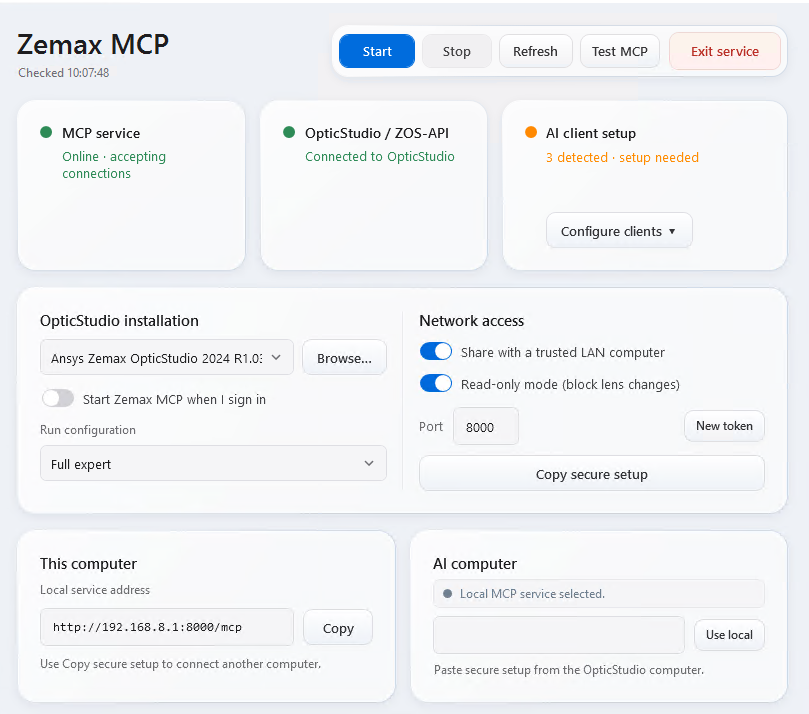
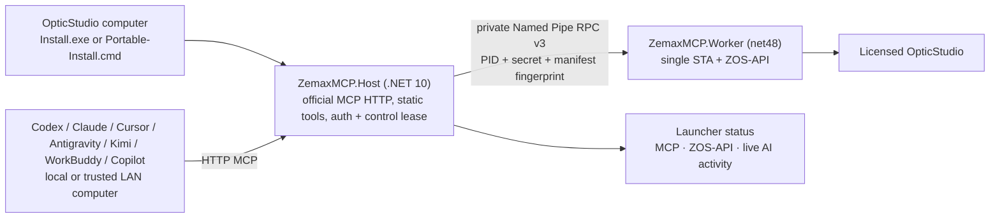

# OpticStudio MCP Server

**A GUI-first Windows MCP server for Zemax OpticStudio.** It detects installed OpticStudio versions, runs an HTTP MCP service locally or on a trusted LAN, and configures **Codex**, **Claude Desktop**, **Cursor**, **Google Antigravity**, **Kimi Code**, **WorkBuddy**, and **VS Code / GitHub Copilot**.

## Windows quick start

1. Download and extract `ZemaxMCP-win-x64.zip` from [Releases](https://github.com/joeyijun/OpticStudioMCPServer/releases).
2. Run **Install.exe**. If Windows policy blocks it, run **Portable-Install.cmd** from the extracted folder instead.
3. On the OpticStudio computer, select its installation. Use **Configure clients** wherever the AI client runs; for a separate AI computer, first paste the secure setup copied from the OpticStudio computer.
4. Restart the configured AI client and make a tool call. The dashboard shows the calling client and tool, or the most recent completed call.

No Node.js, Supergateway, source checkout, or manual ZOS-API DLL copying is required for normal use. The launcher checks full service health every five seconds and refreshes AI activity every second without resetting the status cards to “Checking.”

For one- and two-computer setup, see [Windows Quick Start](docs/QUICKSTART_WINDOWS.md). For component ownership and security boundaries, see [Architecture](docs/ARCHITECTURE.md).

## How it works

```mermaid
flowchart LR
  A["OpticStudio computer\nInstall.exe or Portable-Install.cmd"] --> B["ZemaxMCP.Host (.NET 10)\nofficial MCP HTTP, static tools, auth + control lease"]
  B -->|"private Named Pipe RPC v3\nPID + secret + manifest fingerprint"| C["ZemaxMCP.Worker (net48)\nsingle STA + ZOS-API"]
  C --> F["Licensed OpticStudio"]
  D["Codex / Claude / Cursor / Antigravity / Kimi / WorkBuddy / Copilot\nlocal or trusted LAN computer"] -->|"HTTP MCP"| B
  B --> E["Launcher status\nMCP · ZOS-API · live AI activity"]
```

For a single computer, the AI client uses the local MCP address. For two computers, enable **Share with a trusted LAN computer** on the OpticStudio computer and choose **Copy secure setup**. On the AI computer, paste the complete bundle into the launcher's **Secure setup** field. The launcher extracts the endpoint and token, protects the token with Windows user-scope encryption, and configures supported AI clients. Deploy the same package on both computers to see the latest remote activity display.

## Highlights

- **Refined Windows interface (1.4.2)** — a compact dashboard, matching installer, and rounded Start / Stop / Exit tray menu. Choose **Mica**, **Acrylic**, or **Solid** from the dashboard's bottom toolbar. Native Mica and Acrylic require Windows 11 22H2 or later with transparency effects enabled; Remote Desktop, high contrast, and unsupported systems use a solid fallback. Hover over the material selector to see the actual mode or fallback reason. Mica provides a subtle wallpaper tint; Acrylic provides a frosted desktop backdrop.
- **Graphical install and update** — `Install.exe`, existing portable installs, and in-app updates converge on the same Updater replacement/rollback path for upgrades. Fresh installs copy only runtime payloads; package-only installer/update metadata is not left in the installed tree. Portable fallback is explicit when replacement cannot complete.
- **Official .NET 10 MCP Host** — `ZemaxMCP.Host` uses stable `ModelContextProtocol.AspNetCore` 2.1 for Streamable HTTP, protocol negotiation, request IDs, SSE, cancellation, progress, and compatibility. The application does not maintain a hand-written MCP HTTP/JSON-RPC dispatcher.
- **Static Host tool contract** — a build-time Roslyn generator produces the 132 tool names, descriptions, JSON schemas, domains, and impact levels. `tools/list` is answered by the Host without starting OpticStudio or the Worker.
- **Hardened Host / Worker isolation** — MCP ends at the Host. The `net48` Worker accepts only private RPC v3, keeps STA/ZOS-API state, and never exposes a network transport. The Host verifies Worker PID, per-launch secret, RPC version, and the static manifest SHA-256 fingerprint before ZOS-API initialization or any OpticStudio COM operation.
- **Transport-independent control lease** — modern MCP requests can be stateless while OpticStudio remains deliberately single-owner, single-STA, and serialized. Per-instance identity prevents supported same-machine clients from collapsing into one owner.
- **Authenticated LAN use** — every launcher-managed request uses a random Bearer token. LAN listening is refused without a token, and token rotation is one click.
- **Lens-change safety** — one explicit metadata catalogue drives both the MCP risk display and ZOS-API protection. Read-only mode blocks high-impact operations; in read/write mode, every recognised mutation first saves a timestamped `.zmx` copy of the current lens. ZMX is deliberately used as the cross-version safety format because `.ZOS` was not introduced until OpticStudio 21.3; unknown execution commands fail closed as high impact.
- **Structured progress/events** — Worker progress is coalesced to the newest state per background job while snapshot notifications remain durable. The Host independently coalesces slow-consumer progress, retains bounded recent job state for diagnostics, and forwards matching operation progress through MCP when a request supplied a progress token.
- **Verified, clean updates** — release metadata is RSA-signed, the ZIP size and SHA-256 are checked before extraction, and the updater replaces superseded program files while retaining logs and snapshots; it restores the previous installation if replacement fails.
- **Dedicated ZOS-API thread** — the Worker serializes every connection and tool operation on one long-lived STA thread to respect the COM threading model and avoid cross-thread session access.
- **Long-job control** — POP, global search, and multistart optimization can return immediately with a job id. Jobs retain their originating operation ID, queue/history are bounded, and cancellation has an independent hard-recovery deadline that replaces a stuck Worker generation. Use `zemax_job_status`, `zemax_job_list`, and `zemax_job_cancel` for queue position, live progress, result retrieval, and cooperative cancellation.
- **Live AI activity, including remote clients** — a lightweight authenticated activity endpoint reports each active client, tool, and elapsed time without waiting for Worker status. The launcher polls it every second, shows the most recent completed call when idle, and keeps client-configuration indicators separate from call activity. Its own health checks are not counted as AI calls.
- **Multi-version OpticStudio detection** — detects classic Zemax and current `ANSYS Inc\v*` layouts from environment variables, both registry views, uninstall entries, and known Program Files locations. The launcher validates all three ZOS-API assemblies before offering a version.
- **Cross-version ZOS-API release policy** — the Worker is explicitly x64 for legacy NetHelper compatibility. Release packages are compiled against an explicit oldest-supported OpticStudio/ZOS-API baseline and record that product/API version in `ZOSAPI_BUILD_INFO.txt`. Startup rejects a selected OpticStudio older than the compile baseline before loading Worker code that contains ZOS-API type references. Use `scripts/verify-zosapi-compatibility.ps1` to compile the complete Worker against every actual OpticStudio version that a release claims to support.
- **Safe public package** — the ZIP does not redistribute proprietary ZOS-API DLLs. It uses the licensed OpticStudio installation at runtime on the Zemax computer.

## Reliability and protocol guarantees

MCP `serverInfo.version` is reported by the public Host assembly. The Launcher, Host, Worker, and release `VERSION.txt` are built from the same product version. The structured Worker health RPC independently reports the private RPC version, tool-contract fingerprint, loaded ZOS-API assembly path, actual OpticStudio connection mode, license result, Data directory, snapshots, and job state.

The Host starts independently of the Worker. `tools/list` is served from the static Host manifest and therefore does **not** require the Worker, ZOS-API, an OpticStudio connection, or a valid OpticStudio licence. The first Worker-backed health request or permitted `tools/call` lazily starts the Worker.

The Host creates the current-user-only named pipe before launching the Worker. During startup it authenticates the connecting process using the launched PID and a random per-launch secret, then requires the same private RPC version and exact static-tool-contract SHA-256 fingerprint. This negotiation occurs before the Worker initializes ZOS-API or performs any OpticStudio COM operation, so a mixed or stale Host/Worker package fails clearly instead of executing against a different tool contract. `--worker-startup-timeout-seconds` controls the connection-and-handshake deadline (default **90**, range **10–600**).

The established recovery boundary remains bounded: each normal private RPC write has a **10-second** deadline; a command that exceeds the **300-second** soft timeout immediately starts its hard-recovery deadline and sends a cancellation request with a separately bounded **5-second** pipe-write deadline. The **360-second** hard-recovery deadline is measured from the soft timeout, not after cancellation delivery. A non-responsive Worker is terminated and its pipe generation is invalidated, so the following MCP request starts a clean Worker. Client cancellation ends the HTTP request immediately but leaves a bounded background drain/recovery owner to cancel or restart the Worker.

Browser Origins are configuration-based, never inferred from an incoming `Host` header. Local binding permits only `http://127.0.0.1:*`, `http://localhost:*`, and `http://[::1]:*`. LAN binding requires explicit `--allowed-host` and `--allowed-origin` values. ASP.NET Core Host filtering is enabled with that concrete allowlist, so a spoofed Host header is rejected before it can influence CORS.

### MCP protocol compatibility

The .NET 10 Host uses `ModelContextProtocol.AspNetCore` 2.1.0, so the upstream SDK owns Streamable HTTP negotiation, request IDs, protocol compatibility, SSE, cancellation, and modern stateless behavior. The Worker has no `ModelContextProtocol` dependency and receives only private RPC v3 execution/status/event envelopes.

The static `ZemaxMCP.ToolManifest` is the common contract authority for Host and Worker. It is generated from Worker tool method declarations at build time and contains each tool's name, description, JSON input schema, domain, and impact. The Worker reflection registry only binds JSON arguments to typed C# methods and invokes implementations; it does not generate a second MCP schema.

The separate OpticStudio control lease expires after fifteen minutes without activity unless an operation or an owned background job is active. A background job is bound to the client that created it and to the Worker generation that owns it; terminal job state or Worker-generation replacement releases that hold. Identity resolution prefers a dedicated authenticated client profile, then request-scoped `io.zemaxmcp/clientInstanceId`, then `X-Zemax-MCP-Client-Instance`, then a hashed legacy `Mcp-Session-Id`, and finally `clientInfo.name + clientInfo.version + remote IP`. MCP routing headers such as `Mcp-Name` are never treated as client identity. The packaged Claude/stdin proxy emits a fresh instance identifier for every proxy process.

## OpticStudio / ZOS-API version compatibility

Current Ansys ZOS-API documentation is used to verify the exact contract of modern interfaces, but a release does **not** infer old-version compatibility from the newest documentation. ZOS-API functionality has expanded over time, so source/API compatibility for an older release must be proved against that release's real DLLs.

The release direction is therefore explicit:

1. Run `scripts/verify-zosapi-compatibility.ps1` against every installed OpticStudio family that the release intends to support. This only compiles the Worker against those DLLs and does not start OpticStudio or consume a license.
2. Build the release Worker against the **oldest** version that passed the compile matrix by setting `ZEMAX_API_BASELINE_ROOT`.
3. The package records the baseline `OpticStudio.exe` and ZOS-API versions in `ZOSAPI_BUILD_INFO.txt`.
4. At Worker startup, the selected OpticStudio product/API versions are compared with that baseline **before** `ServerApplication` is loaded. An older runtime is rejected explicitly instead of being allowed to fail later with `MissingMethodException`/`TypeLoadException`.
5. Finally run licensed live acceptance on each version family that will be advertised as supported.

Known legacy differences are handled deliberately. Automatic safety snapshots and unsaved multistart checkpoints use `.zmx`, because `.ZOS` did not exist before OpticStudio 21.3. Enhanced Ray Aiming options that evolved during 2021 and became formal in 22.1 are capability-detected; early versions return `null` and `UnsupportedSettings` for unavailable optional fields rather than fabricating values or raising the minimum API for the entire Worker.

See `docs/ZOSAPI_COMPATIBILITY.md` for the current 2021/2023/2024/2026 compatibility matrix and release policy.

## Release validation

Hosted CI validates the public/static contract, safety metadata, Host/private-RPC boundary, recovery paths, desktop packaging, updater rollback, signed-update tamper rejection, and the cross-version ZOS-API policy guards. It also runs functional safety guards that keep global ZOS-API initialization in Worker startup and prohibit ReadOnly analysis tools from structurally modifying the user's Merit Function Editor.

A licensed OpticStudio installation is still required for release acceptance. `scripts/verify-live-mcp.ps1` verifies the transport/contract/safety boundary, while `scripts/verify-live-functional.ps1` copies a supplied ZMX/ZOS fixture to a temporary working file and performs real edit/readback plus optional optimization, background-job, NSC, and tolerance acceptance, emitting a JSON report. `docs/RELEASE_VALIDATION.md` records the staged 132-tool review, old-version compile matrix, and exact live release gate. A green hosted workflow is therefore necessary but is not claimed as proof that every ZOS-API operation has been exercised against a real OpticStudio build.

## Connection modes

| Mode | Intended use |
|---|---|
| **Standalone** | Starts or controls an OpticStudio session for automated work. |
| **Extension** | Connects to an already-running OpticStudio session for interactive work. |

`zemax_connect` compares both the requested mode and Extension instance ID with the current connection. Standalone mode normalizes the irrelevant instance ID to `0`; if the requested connection target differs from the current one, it cleanly disconnects and reconnects. `zemax_status` reports the actual active mode. Use the launcher status dashboard to confirm that ZOS-API is loaded and OpticStudio is connected before asking the AI to work on a design.

For inspection-only sessions, enable **Read-only mode** before connecting the AI. In normal read/write mode, automatic lens snapshots are kept under `%LOCALAPPDATA%\ZemaxMCP\snapshots` (up to the newest 100 files). The status details show the active protection mode, snapshot folder, and most recent snapshot created in the current Worker session.

## Zemax discovery and license diagnostics

The dashboard reports the selected OpticStudio program folder, how it was discovered, the resolved `ZOSAPI.dll`, `ZOSAPI_Interfaces.dll`, and `ZOSAPI_NetHelper.dll` paths, the Zemax Data folder, and license status. After startup it separately reports each assembly's actual CLR load path, so “found” and “loaded” are independently visible. `ZOSAPI_NetHelper.dll` is supported both beside `ZOSAPI.dll` and in the newer `ZOS-API\Libraries` layout.

The Data folder is resolved from `ZEMAX_DATA_ROOT`, the OpticStudio user registry (`HKCU\SOFTWARE\Zemax\ZemaxRoot`), redirected Windows Documents, the normal `Documents\Zemax` location, or the OpticStudio Online default. The presence of `Data\License`, `Data\Configs\SNTLCONFIG.XML`, or `ANSYSLMD_LICENSE_FILE` is shown only as configuration evidence. The authoritative license result is reported after ZOS-API actually connects; secret environment-variable values are never written to logs.

For an unusual portable layout, set `ZEMAX_ROOT` to the program directory and optionally `ZEMAX_DATA_ROOT` to the Data directory before starting the launcher.

## AI client configuration

Use **Configure clients** in the launcher. Existing unrelated MCP entries are preserved and a backup is kept when an existing configuration is replaced. Supported HTTP clients receive both the endpoint and its Bearer header; Claude's packaged proxy receives the token without putting it in the server URL. If a token is rotated, reconfigure each client so its saved credential matches. A green dot in the configuration menu means the local client configuration matches; the separate AI activity card turns green only while a tool call is in progress.

| Client | Configuration used by the launcher | Connection confirmation |
|---|---|
| Codex | `$CODEX_HOME/config.toml`, or `~/.codex/config.toml` | Make a tool call; the activity card reports the client and tool. |
| Claude Desktop | `%APPDATA%/Claude/claude_desktop_config.json`; the packaged local stdio proxy reaches the HTTP/LAN endpoint and provides per-process client identity | Restart Claude, then make a tool call and check the activity card. |
| Cursor | `~/.cursor/mcp.json` | Make a tool call and check the activity card. |
| Google Antigravity | `~/.gemini/config/mcp_config.json` (an existing legacy Antigravity configuration is detected and preserved in place) | The launcher writes Antigravity's remote `serverUrl` plus the Bearer header. Restart Antigravity, then use its MCP Servers panel or `/mcp` to confirm the connection. |
| Kimi Code | `$KIMI_CODE_HOME/mcp.json`, or `~/.kimi-code/mcp.json` | Run `/mcp` in Kimi Code, then make a tool call and check the activity card. See the [official Kimi MCP guide](https://www.kimi.com/code/docs/en/kimi-code-cli/customization/mcp.html). |
| WorkBuddy | `~/.workbuddy/mcp.json` | WorkBuddy shows its own green/red MCP status; the launcher also records real requests. See the [official WorkBuddy MCP guide](https://www.workbuddy.ai/docs/zh/workbuddy/From-Beginner-to-Expert-Guide/Function-Description/MCP-Guide). |
| VS Code / Copilot | Native `vscode:mcp/install` review flow; status checks the default and profile-specific `mcp.json` files | Approve the server in VS Code, then make a request. |

Clients capable of setting custom MCP request metadata may send `io.zemaxmcp/clientInstanceId`; HTTP clients may instead send `X-Zemax-MCP-Client-Instance`. The value must be 1–128 ASCII letters/digits plus `.`, `_`, or `-`. This is useful when multiple independent client instances share the same IP and the same standard `clientInfo`.

## MCP capabilities

The full-expert package contains 132 named tools; a narrower run configuration exposes only its permitted subset. AI clients discover the exact version-matched schemas through MCP `tools/list`; `zemax_tool_catalog` reads the same static manifest and returns each tool's domain, impact, description, and safety guidance. Use the installed package's `tools/list` as the authoritative source rather than treating this README as a complete API reference.

### Tool navigation, run configurations, and safety

The launcher can expose a smaller task-focused tool surface without renaming MCP tools. The Host enforces the selected profile for both `tools/list` and direct `tools/call`; the Worker checks it again before ZOS-API execution.

| Launcher configuration | Enabled domains and impacts |
|---|---|
| **View & analyze** | 34 explicitly selected read-only inspection/analysis tools |
| **Sequential design** | 76 explicitly selected sequential edit, system, file, polarization, and analysis tools |
| **Non-sequential & stray light** | 19 explicitly selected NSC inspection, tracing, system/file, polarization, and diagnostic tools |
| **Optimization & tolerancing** | 63 explicitly selected optimization, job, tolerance, core sequential, file, and verification tools |
| **Full expert** | All 132 tools and all impacts |

Global **Read-only mode** and the task profile are separate controls. Global read-only blocks `HighImpact` operations while preserving `Caution` session/connection operations; **View & analyze** limits the profile itself to explicit `ReadOnly` impact.

`zemax_tool_catalog` groups tools as follows:

| Group | Use it for | Typical first step |
|---|---|---|
| **System** | System state, catalog information, and safe inspection. | Confirm `zemax_status` and inspect the active system. |
| **Sequential editing** | Surfaces, fields, wavelengths, apertures, configurations, and solves. | Read the current data before changing one item. |
| **Non-sequential** | NSC objects, detectors, scene structure, and stray-light workflows. | Start with `zemax_nsc_scene_summary`, then inspect specific objects/detectors. |
| **Analysis** | Spot, MTF, PSF, POP, rays, aberrations, illumination, and export. | Analyse the design and retain the result. |
| **Optimization** | Merit functions, optimization, global search, and jobs. | Inspect variables and merit data before launching a long job. |
| **Tolerance** | Tolerance setup and result inspection. | Start with `zemax_tolerance_summary`, then inspect individual operands/bounds. |
| **Polarization** | Polarization settings and inspection. | Inspect settings before changing amplitudes or phases. |
| **Files** | Opening, saving, importing, and exporting artifacts. | Confirm the current system and destination path. |
| **Administration** | Connection, session, and service management. | Verify the Worker connection before starting a task. |

**High impact** operations can change lens data, saved files, or optimization state. Confirm the target system and intended change before calling one. In read/write mode, recognised ZOS-API mutations create a pre-change lens snapshot. **Caution** operations can change the active session, connection, or job state; **Read-only** operations are intended for inspection or calculation.

A safe default workflow is: inspect the system → make the smallest necessary edit → run an analysis → save or export deliberately. For POP, global search, or multistart optimization, use the returned Job ID with `zemax_job_status` and `zemax_job_cancel` rather than waiting on a long synchronous request.

Major tool areas include system/file operations; Lens Data Editor surfaces, fields, wavelengths, apertures, solves, and extra data; NSC objects and detectors; imaging and optical analyses; merit functions and optimization; multi-configuration, tolerance, polarization, system settings, and glass catalogs; and background job control.

This fork includes these acceptance and validation tools:

| Tool | Purpose |
|---|---|
| `zemax_set_surface_aperture` / `zemax_get_surface_aperture` | Set or inspect real circular apertures and obscurations. |
| `zemax_set_off_axis_conic` | Set Off-Axis Conic Freeform offset and normalization radius. |
| `zemax_get_global_matrix` | Read a surface local-to-global rotation matrix and vertex origin. |
| `zemax_aperture_throughput` | Sample pupil throughput and identify vignette surfaces. |
| `zemax_ray_trace_extended` | Trace a real ray with intercept, direction, intensity, error, and vignette data. |
| `zemax_ray_trace_diagnostics` | Sample a bounded field/pupil grid and localize problematic rays to the first surface that reports an error or vignette code. |
| `zemax_batch_set_surfaces` | Atomically apply multiple sequential-surface edits with one safety snapshot, independent readback, and rollback on failure. |

### Additional tools in this fork

| Tool | Purpose |
|---|---|
| `zemax_get_nsc_objects` / `zemax_get_nsc_detector` / `zemax_get_nsc_object_parameters` | Inspect NSC objects, detector properties, and type-specific parameters. |
| `zemax_nsc_scene_summary` | Summarize NSC scene structure, object types, detectors, references, nesting, materials, and structural warnings. |
| `zemax_tolerance_summary` | Summarize TDE operand types, active/ignored state, bounds, and structural warnings without pretending to run Monte Carlo. |
| `zemax_run_tolerancing` | Run bounded sequential Sensitivity + Monte Carlo tolerancing, read the generated ZTD through Tolerance Data Viewer, return structured column statistics and worst sensitivity operands, and optionally evaluate a caller-defined pass threshold/direction. |
| `zemax_get_tolerances` | Read Tolerance Data Editor operands safely, including unset bounds. |
| `zemax_set_number_of_fields` / `zemax_set_number_of_wavelengths` | Resize the system field or wavelength lists. |
| `zemax_get_apodization` / `zemax_set_apodization` | Inspect or set pupil apodization type and factor. |
| `zemax_get_clear_semi_diameter_margin` / `zemax_set_clear_semi_diameter_margin` | Inspect or set Clear Semi-Diameter Margin; availability depends on ZOS-API version. |
| `zemax_get_mtf_units` / `zemax_set_mtf_units` | Inspect or set MTF units. |
| `zemax_get_system_metadata` / `zemax_set_system_metadata` | Read or update title, author, and notes without saving automatically. |
| `zemax_get_environment` / `zemax_set_environment` | Inspect or set temperature, pressure, and refractive-index adjustment. |
| `zemax_get_polarization` / `zemax_set_polarization` | Inspect or set polarization amplitudes, phases, and method. |
| `zemax_get_units` / `zemax_get_system_files` | Inspect units and selected coating, scatter, ABg, and GRIN files. |
| `zemax_get_aperture_settings` / `zemax_get_advanced_system_settings` | Inspect aperture and advanced system settings. |
| `zemax_get_ray_aiming_settings` / `zemax_get_material_catalog_settings` | Inspect ray aiming and material catalog settings. |
| `zemax_get_nonsequential_system_settings` | Inspect NSC ray limits, thresholds, splitting, and source-file settings. |
| `zemax_get_stop_surface` / `zemax_set_stop_surface` | Inspect or change the sequential aperture stop. |
| `zemax_get_first_order_data` | Calculate first-order optical properties. |
| `zemax_get_vignetting` / `zemax_set_vignetting` / `zemax_clear_vignetting` | Inspect, calculate, or clear per-field vignetting factors. |
| `zemax_get_field_settings` / `zemax_get_wavelength_settings` | Inspect field and wavelength settings. |
| `zemax_quick_focus` | Run Quick Focus with a bounded timeout. |
| `zemax_scale_lens` | Scale a sequential lens or convert its physical units. |

## Fork and attribution

This repository is a fork of the MIT-licensed **OpticStudio MCP Server** by Javier A Ruiz. This fork adds the packaged Windows launcher, GUI installer, official HTTP MCP Host, trusted-LAN workflow, live status dashboard, graphical AI-client configuration, contract/recovery hardening, and additional tools.

The original copyright and MIT license are retained in [LICENSE](LICENSE). A valid Zemax OpticStudio licence is required for Worker-backed optical operations.

## Release maintainers

Build the public ZIP on a trusted Windows computer against the oldest OpticStudio/ZOS-API installation the release intends to support. Keep ZOS-API files outside source control and out of the public package. After uploading the ZIP to a GitHub Release, run the hosted **Sign Windows release package** workflow to attach the RSA-signed `release-manifest.json`; automatic updates require the repository secret `UPDATE_SIGNING_PRIVATE_KEY_B64`. See [Windows Quick Start](docs/QUICKSTART_WINDOWS.md#maintainers-publishing-an-update) and [Release Validation](docs/RELEASE_VALIDATION.md) for the offline-build and acceptance workflow.
